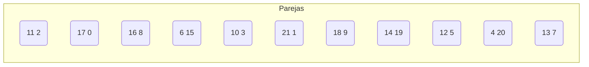
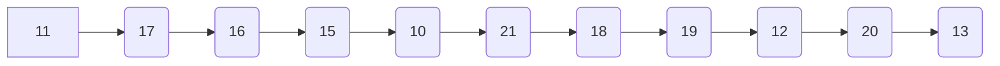
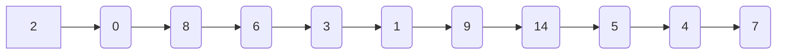

### Original sequence of numbers.

```mermaid
graph LR
    A[11] --> B(2)
    B --> C(17)
    C --> D(0)
    D --> E(16)
    E --> F(8)
    F --> G(6)
    G --> H(15)
    H --> I(10)
    I --> J(3)
    J --> K(21)
    K --> L(1)
    L --> M(18)
    M --> N(9)
    N --> O(14)
    O --> P(19)
    P --> Q(12)
    Q --> R(5)
    R --> S(4)
    S --> T(20)
    T --> U(13)
    U --> V(7)
```

### Pairs agrupation

```mermaid
graph LR
    subgraph Parejas
        P1(11 2)
        P2(17 0)
        P3(16 8)
        P4(6 15)
        P5(10 3)
        P6(21 1)
        P7(18 9)
        P8(14 19)
        P9(12 5)
        P10(4 20)
        P11(13 7)
    end
```
### Pairs sort

```mermaid
graph TD
    subgraph Pareja_1
        A1[11] --> B1(2)
    end
    subgraph Pareja_2
        A2[17] --> B2(0)
    end
    subgraph Pareja_3
        A3[16] --> B3(8)
    end
    subgraph Pareja_4
        A4[15] --> B4(6)
    end
    subgraph Pareja_5
        A5[10] --> B5(3)
    end
    subgraph Pareja_6
        A6[21] --> B6(1)
    end
    subgraph Pareja_7
        A7[18] --> B7(9)
    end
    subgraph Pareja_8
        A8[19] --> B8(14)
    end
    subgraph Pareja_9
        A9[12] --> B9(5)
    end
    subgraph Pareja_10
        A10[20] --> B10(4)
    end
    subgraph Pareja_11
        A11[13] --> B11(7)
    end
```
### Split in sequences main and pend

```mermaid
graph LR
    A[11] --> B(17)
    B --> C(16)
    C --> D(15)
    D --> E(10)
    E --> F(21)
    F --> G(18)
    G --> H(19)
    H --> I(12)
    I --> J(20)
    J --> K(13)
```

```mermaid
graph LR
    A[2] --> B(0)
    B --> C(8)
    C --> D(6)
    D --> E(3)
    E --> F(1)
    F --> G(9)
    G --> H(14)
    H --> I(5)
    I --> J(4)
    J --> K(7)
```

```mermaid
graph TD
    subgraph Secuencia_Main
        M1[11] --> M2(17)
        M2 --> M3(16)
        M3 --> M4(15)
        M4 --> M5(10)
        M5 --> M6(21)
        M6 --> M7(18)
        M7 --> M8(19)
        M8 --> M9(12)
        M9 --> M10(20)
        M10 --> M11(13)
    end
    
    subgraph Secuencia_Pend
        P1[2] --> P2(0)
        P2 --> P3(8)
        P3 --> P4(6)
        P4 --> P5(3)
        P5 --> P6(1)
        P6 --> P7(9)
        P7 --> P8(14)
        P8 --> P9(5)
        P9 --> P10(4)
        P10 --> P11(7)
    end

    %% Definición de Estilos (Clases)
    classDef mainStyle fill:#0077b6,stroke:#0077b6,stroke-width:2px,color:white
    classDef pendStyle fill:#e63946,stroke:#e63946,stroke-width:2px,color:white

    %% Aplicación de Estilos a los Nodos de Main
    class M1,M2,M3,M4,M5,M6,M7,M8,M9,M10,M11 mainStyle

    %% Aplicación de Estilos a los Nodos de Pend
    class P1,P2,P3,P4,P5,P6,P7,P8,P9,P10,P11 pendStyle
```
