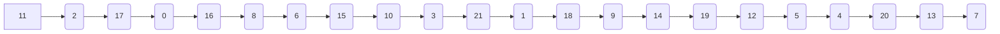

```mermaid
graph LR
    A[11] --> B(2)
    B --> C(17)
    C --> D(0)
    D --> E(16)
    E --> F(8)
    F --> G(6)
    G --> H(15)
    H --> I(10)
    I --> J(3)
    J --> K(21)
    K --> L(1)
    L --> M(18)
    M --> N(9)
    N --> O(14)
    O --> P(19)
    P --> Q(12)
    Q --> R(5)
    R --> S(4)
    S --> T(20)
    T --> U(13)
    U --> V(7)
```
